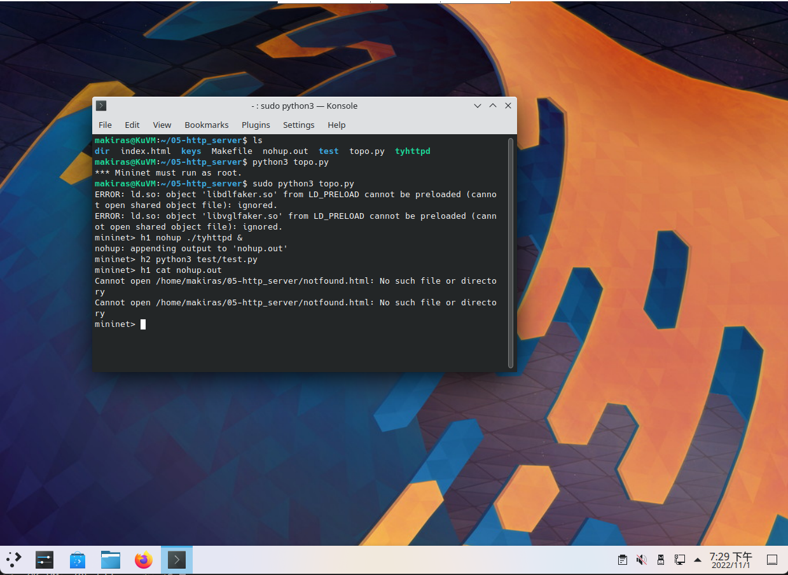

# 计算机网络实验报告 - 实验五 HTTP 服务器实验
小组成员：谢云龙 202218013229040，田韵豪 202218013229065

## TCP 流实现

由于服务器需要处理 HTTP 明文请求和 HTTPS 加密请求，因此编写了一个 `MyStream` 结构体（位于 `stream.h` 文件中），结构体中提供了 3 个函数指针 `read`、`write`、`destroy`。在初始化流时，只需要将这些函数指针赋值为该流对应的操作函数，使用者就可以用一套统一的接口来读写流。

对于普通的 TCP 流，`read` 和 `write` 函数直接调用对应的 syscall 函数，并传递 TCP 流的文件描述符作为参数。对于 TLS 流，程序调用 OpenSSL 库封装的对应函数，详见以下“TLS 实现”一节。

## HTTP 头解析实现

在 `http.c` 中实现了对 HTTP 头部的解析。解析使用一个状态机实现，状态机包含以下状态，每个状态的含义在注释中描述：

```C
enum HttpParserStatus {
  kMethod,         // 正在读取请求的 HTTP 方法
  kUri,            // 正在读取请求的 URI
  kVersion,        // 正在读取请求的 HTTP 版本
  kHeaderName,     // 正在读取请求头的名称
  kHeaderValue,    // 正在读取请求头的值
  kEnding,         // 正在读取请求末尾的换行符
};
```

状态机执行时，每次从流中读取一个块，然后对块中的数据逐字节进行分析。在状态内转移的条件是遇到字母或数字；在状态间转移的条件则是符号（冒号、换行或空格）。状态机还实现了一定的错误处理，如果收到了错误的请求头，会进行报错。

状态机解析结果保存在 `HttpRequest` 结构中，其字段如下，包含 HTTP 请求的方法、URI、各个请求头。外部代码获得头部的解析结果后，即可进行请求的处理。

```C
struct HttpHeader {
  char name[MAX_SHORT_LEN];
  char value[MAX_LEN];
  struct HttpHeader* next;
};

struct HttpRequest {
  char method[10];
  char uri[MAX_LEN];
  struct HttpHeader* headers;
};
```

## 响应文件的发送
解析完请求头部后，程序调用 `ServeFile` 函数来发送响应。`ServeFile` 会先对请求进行 URL 解码，还原出请求中可能存在的特殊符号，然后根据当前目录路径和 URI 整合出请求文件的路径，并检查路径的合法性。如果请求文件不存在，则返回 404；如果文件存在，则打开文件，并根据是否有 Range 信息来调整文件流的位置。最后，使用 while 循环读取文件并发送。发送完后，断开连接。

## 部分内容（Partial Content）的处理
程序会根据请求是否存在 `Range` 头部分别进行处理。如果 `Range` 头部不存在，则返回完整文件内容，并增加 `Accept-Ranges: bytes` 响应头，告知客户端支持范围请求；如果 `Range` 存在，则根据该头部的内容设定响应文件的开头位置和结尾位置。

## TLS 实现

`HttpsStream`基于`MyStream`结构体实现，具体拓扑如下：

```C
struct MyStream {
    void *priv => 
        struct ssl_stream_priv{
            SSL_CTX *ssl;
            int fd;
        };
    void *userdata => NULL | SSL *ssl (after accept) ;
    read_function read;
  	write_function write;
  	destroy_function destroy;
}
```

具体实现中，当负责`https`的`pthread`接收到新的`tcp`请求后，会将对应的`file descriptor`传递给`InitTlsStream()`进行`ssl`上下文的初始化。

初始化过程中，程序首先会申请内存空间，设定`fd`，并储存函数指针。接下来程序会加载`SSL`库，设定上下文只接受`TLSv1-TLSv1.3`版本的请求，并验证上下文创建成功后加载证书文件。

初始化完成后，该函数返回一个`MyStream`结构体，并将该结构体传递给新创建的`pthread`进行处理。

在处理过程中，对`Stream`的首次读取会创建一个`SSL`会话，创建时会检查`MyStream`是否存在已绑定的会话。如果有，则返回已有对话，如果没有，则调用`SSL_accpet()`函数进行验证及握手流程，并将该会话储存在`MyStream`的`userdata`字段。

实际上，`read`,`write`,`destory`都会首先调用一次`accept`以确保完成了握手，避免未预期的行为。如果在握手过程中遇到客户端拒绝握手或者连接中断的问题（例如`curl`和`chrome`默认拒绝与自签名证书握手），`accept`会返回空指针，需要针对这种情况做特殊处理。

在`tls_accept()`返回空指针后，`tls_read()`和`tls_write()`均会返回`-1`。调用该部分的函数（以`ParseRequest()`为例）在得到非正常结果后，会终止执行，清空会话及上下文，释放内存空间并返回空指针。最终最上层的`ConnectionHandler`得到空指针后，会认为链接出现问题，直接进行流的销毁与清理。至此，异常处理完成。如果不对握手异常进行处理，可能造成程序异常循环或崩溃。

## 301 重定向实现

在进行重定向检查之前，程序已经完成了基本的`HTTP header`解析。而如果是`HTTPS`请求，也代表程序已经完成了`SSL`握手，`stream->userdata`也指向了`SSL`会话。

那么我们只需要检查`stream->userdata`是否为空，即可确定是否是`HTTPS`请求，是否需要重定向。同时如果`SSL`会话失效，程序会在解析`header`时就结束链接，因此不会出现因会话失效导致`stream->userdata`为空的情况。

如果确定为`HTTP`请求，只需要依据`header`中的`$host`及`$uri`拼接成`https://$host$uri`进行重定向即可完成。

## MinNet测试

### 基本功能测试



可以看到，在`mininet`环境中，程序可以正常运行通过测试脚本，没有新报错。并且在遇到未找到的文件时，程序会在日志中记录`404`错误。


可以看到，从`mininet`环境中打开的`VLC`可以正常播放`jojobible.mp4`视频文件，并且可以拖动进度条。

### HTTP 传输分析


实际上因为`TCP`流式传输的特性，针对大部分传输的`TCP`包，`wireshark`并不能将其识别为`HTTP`数据包，而只是作为普通的`TCP`流处理。尽管我们可以使用`wireshark`的`HTTP`过滤器，但是由于`wireshark`的`HTTP`过滤器并不是基于`HTTP`协议的语法进行过滤的，而是基于`TCP`流的特征进行过滤的，因此会导致一些`HTTP`数据包被过滤掉。如图所示，我们只得到了一些请求与响应的`HTTP`头部信息，而没有得到`HTTP`的实体内容。

但尽管如此，我们仍然可以看到 `Content-Length` 字段，以及 `Content-Type`，`Content-Range` 字段，这些字段可以帮助我们判断出响应的实体内容的类型，长度以及位置。

### HTTPS 传输分析


我们可以发现，当`TCP`握手完成后，`TLS`客户端与服务器之间会进行`TLS`握手，`TLS`握手完成后，`TLS`客户端与服务器之间就可以进行经过`tls`加密的`HTTP`请求与响应了。

`TLS`的握手过程为：
1. 客户端发送`ClientHello`，包含`TLS`版本号，客户端支持的`cipher suite`，`compression method`等信息。
2. 服务器发送`ServerHello`，包含`TLS`版本号，服务器选择的`cipher suite`，`compression method`等信息。
3. 服务器发送`Certificate`，包含服务器的证书。
4. 服务器发送`ServerHelloDone`，表示`ServerHello`发送完毕。
5. 客户端发送`CertificateVerify`，包含客户端的证书。
6. 客户端发送`ClientKeyExchange`，包含客户端生成的`pre-master secret`。
7. 客户端发送`ChangeCipherSpec`，表示客户端的`cipher suite`已经改变。
8. 客户端发送`Finished`，表示客户端的`TLS`握手已经完成。
9. 服务器发送`ChangeCipherSpec`，表示服务器的`cipher suite`已经改变。
10. 服务器发送`Finished`，表示服务器的`TLS`握手已经完成。

握手过程中由于`TCP`流特征，多个包会合并，因此我们在`wireshark`中看到的`TLS`握手包是合并在一起的。


我们可以看到，`TLS`握手完成后，`TLS`客户端与服务器之间就可以进行经过`tls`加密的`HTTP`请求与响应了。由于`TLS`加密的特性，我们无法直接看到`HTTP`的`Header&Payload`内容。

但尽管如此，我们仍然可以发现`HTTPS`数据流使用的协议是`TLSv1.2`，并且一段`Payload`会因为`MTU`的限制被分成多个`TCP`包发送，不同段的`Payload`可能被组装到同一个`TCP`包中。